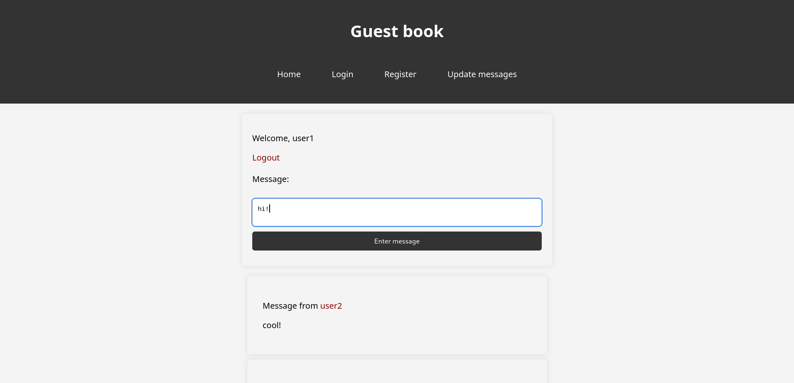

# Guest Book Project

This project is a guest book written in PHP.



## Project Structure

The project includes the following main components:

- **Nginx**: Web server for handling requests and serving static files.
- **MySQL**: Database management system for data storage.
- **PHP**: Programming language for server-side logic.

## Getting Started

To get started with the project, you will need Docker and Docker Compose installed.

### Installing Docker Desktop

You can find Docker Desktop installation instructions [here](https://docs.docker.com/desktop/).

##   

## Running the Project

To run the project, follow these steps:

1. Сreate a `.env` file in the root directory with the following content:

```env
DB_ROOT_PASSWORD=root
DB_USER=username
DB_PASSWORD=secret
DB_DATABASE=guestbook
DB_HOST=db
DB_DRIVER=pgsql
```


2. Create tables by using this SQL query:
```mysql
CREATE TABLE users
(
    id       INT PRIMARY KEY AUTO_INCREMENT,
    username VARCHAR(255) UNIQUE NOT NULL,
    password VARCHAR(255)        NOT NULL
);

CREATE TABLE user_messages
(
    id      INT PRIMARY KEY AUTO_INCREMENT,
    user_id INT  NOT NULL,
    message TEXT NOT NULL,
    FOREIGN KEY (user_id) REFERENCES users (id) ON DELETE CASCADE
);
```

3. Navigate to the `docker` directory:

```shell
cd docker
```

4. Start the containers in detached mode:

```shell
docker compose up -d
```

## Stopping the Project

To stop the project, run the following command:

```shell
docker compose down
```

## Configuration

### Nginx

The **Nginx** configuration file is located at `docker/nginx/nginx.conf`. It's already preconfigured, so you do not have to
worry about it.

### PostgresSQL

The **PostgresSQL** database configuration is set in the `docker-compose.yml` file and environment variables are loaded from
the `.env` file you created.

### PHP

The PHP-fpm container image is described in `docker/php/Dockerfile`

